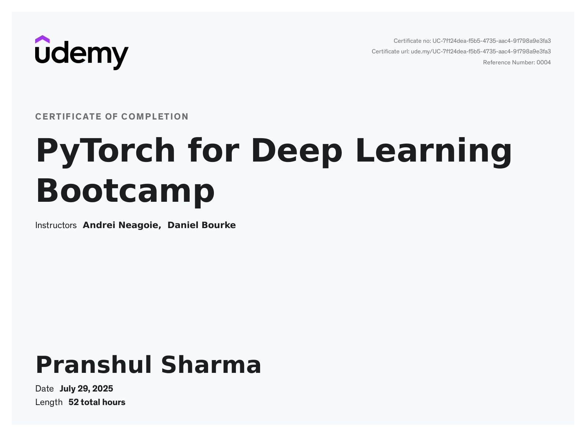

# PyTorch for Deep Learning - Complete Professional Certification

## 📋 Overview

This repository showcases my comprehensive mastery of PyTorch and deep learning through the completion of **"PyTorch for Deep Learning"** by Daniel Bourke on Udemy - one of the most highly-regarded and comprehensive PyTorch courses available. This intensive, hands-on program equipped me with production-ready skills in deep learning engineering.

## 🎓 Course Completion & Certification

**Course:** PyTorch for Deep Learning  
**Instructor:** Daniel Bourke (Professional ML Engineer & Renowned Educator)  
**Platform:** Udemy  
**Status:** ✅ **COMPLETED WITH CERTIFICATION**  
**Course Type:** Comprehensive Bootcamp (Project-Based Learning)

### 📜 Official Certificate

*Click to view full certificate details*

---

## 🚀 Technical Skills Acquired

### Core PyTorch Proficiencies

- **PyTorch Fundamentals**: Deep understanding of tensor operations, data representation, and PyTorch ecosystem
- **PyTorch Workflow**: End-to-end pipeline from raw data to deployed neural network models
- **Neural Network Classification**: Building robust classification models for real-world applications
- **Computer Vision**: Advanced image processing and classification using convolutional neural networks
- **Custom Dataset Integration**: Loading, preprocessing, and managing proprietary datasets
- **Modular Code Architecture**: Converting experimental notebooks into production-ready Python scripts

### Advanced Deep Learning Techniques

- **Transfer Learning**: Leveraging pre-trained models for enhanced performance and efficiency
- **Experiment Tracking**: Systematic model performance monitoring and optimization
- **Research Paper Implementation**: Replicating cutting-edge architectures including Vision Transformers
- **Model Deployment**: Full-stack deployment of PyTorch models to web applications

---

## 🛠️ Projects & Practical Applications

### Milestone Project: FoodVision
A comprehensive computer vision system capable of classifying food images with high accuracy:

- **FoodVision Mini**: Multi-class classification (Pizza, Steak, Sushi)
- **Vision Transformer Implementation**: Reproduced state-of-the-art ViT architecture
- **Web Deployment**: Publicly accessible model interface for real-time predictions

### Key Technical Implementations

1. **Custom Neural Networks**: Built from scratch using PyTorch primitives
2. **Data Pipeline Engineering**: Efficient data loading and preprocessing systems
3. **Model Optimization**: Performance tuning and hyperparameter optimization
4. **Production Deployment**: End-to-end model serving infrastructure

---

## 💼 Industry-Relevant Experience

This certification demonstrates proficiency in technologies and methodologies used by leading tech companies:

- **Tesla**: Computer vision for autonomous vehicles
- **Meta**: Content understanding and curation systems  
- **Apple**: Computational photography enhancement
- **Modern AI Research**: Implementation of latest research papers and architectures

---

## 🎯 Professional Value Proposition

### Deep Learning Engineering Capabilities
- Design and implement neural networks for complex real-world problems
- Optimize model performance for production environments
- Build scalable machine learning pipelines
- Deploy AI solutions with public accessibility

### Research & Development Skills
- Translate academic research into practical implementations
- Experiment with cutting-edge architectures
- Systematic approach to model development and evaluation

---

## 🔧 Technical Stack Mastery

**Primary Frameworks:**
- PyTorch (Advanced)
- Python (Expert-level for ML applications)

**Development Environment:**
- Jupyter Notebooks (Experimentation)
- Python Scripts (Production)
- Google Colab (Cloud Computing)

**Specialized Areas:**
- Computer Vision
- Neural Network Architecture Design
- Transfer Learning
- Model Deployment & MLOps

---

## 📈 Career Impact

This comprehensive PyTorch certification positions me as a qualified candidate for:

- **Deep Learning Engineer** roles
- **Machine Learning Engineer** positions  
- **AI Research & Development** opportunities
- **Computer Vision Specialist** roles

**Salary Range Qualification:** $100,000+ annually for Deep Learning Engineering positions

---

## 🏆 Why This Certification Matters

**Comprehensive Curriculum**: Far beyond basic tutorials - covers the full ML lifecycle from research to deployment

**Industry Recognition**: Daniel Bourke is a respected ML engineer and educator with extensive real-world experience

**Hands-On Approach**: Project-based learning with real-world applications and deployable solutions

**Current & Cutting-Edge**: Covers latest techniques including Vision Transformers and modern deployment practices

---

## 📞 Ready to Apply These Skills

I am immediately ready to contribute to deep learning projects and continue advancing in the rapidly evolving field of artificial intelligence. This certification represents not just theoretical knowledge, but proven ability to build, optimize, and deploy production-ready deep learning solutions.

---

*This portfolio demonstrates commitment to continuous learning and mastery of industry-standard deep learning tools and techniques.*